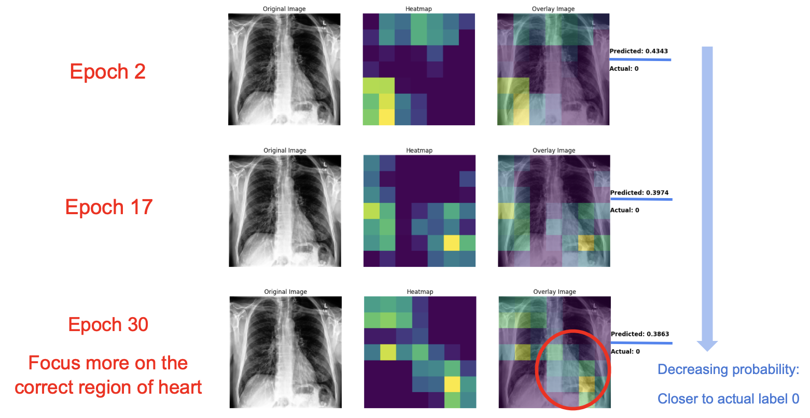

# Cross-Dataset Generalization and Explainable AI for Interpretable Chest Radiograph Classification

## Introduction

Many studies have demonstrated that deep learning can perform well in medical image classification.
However, in many medical machine learning tasks, while models often achieve high accuracy in
disease prediction, it remains unclear which specific features they rely on due to the black-box nature
of AI. For example, when predicting a diagnosis from medical images, it is difficult to determine
which areas of the image the model primarily focuses on for classification. This lack of transparency
can undermine trust in machine learning among healthcare professionals.

To evaluate the model’s practical applicability in real-world scenarios, we conducted cross-dataset
generalization experiments. Specifically, we tested whether the model could maintain similar per-
formance when evaluated on external datasets. This step was crucial for assessing the model’s
ability to generalize to unseen data, which helps determine its reliability and robustness in real-world
applications where data from new sources or populations may be encountered.

To better understand the model’s decision-making process, we applied explainable AI techniques to
analyze the model in detail. These techniques allowed us to identify which features in the images
influenced the model’s decisions by highlighting the most important regions. This analysis also helps
determine whether the model is "cheating" by relying on information from labels or marks on the
images, rather than learning meaningful features from the images themselv

## Methodology

The study utilized the CheXpert and NIH ChestX-ray8 datasets for model training and evaluation, focusing on cross-dataset generalization. 
A DenseNet-121 model pretrained on ImageNet was fine-tuned for chest radiograph classification, predicting 14 disease labels. 
Grad-CAM and DeepSHAP were applied as explainable AI techniques to highlight key image regions influencing predictions and assess feature importance, ensuring model transparency and reliability for real-world applications.

## Results

For the model trained on the CheXpert dataset, we applied two different datasets for testing. Although the AUC values for the six common classes vary, the mean AUC across these classes remains similar. Interestingly, the external dataset testing even yields a slightly better AUC. It represents that this model shows a good generalization because it can be apply on different dataset without decreased AUC.

For the model trained on the NIH dataset, we also used two dataset for internal and external testing. For external testing, the AUC decreases across all classes, and the mean AUC drops significantly from 0.80 to 0.68. Although the NIH model shows relatively better internal testing performance, its poor external performance suggests potential overfitting or the model relying on incorrect shortcuts during learning. Given that NIH has a larger dataset, these results also indicate that a larger dataset does not always guarantee better performance.

